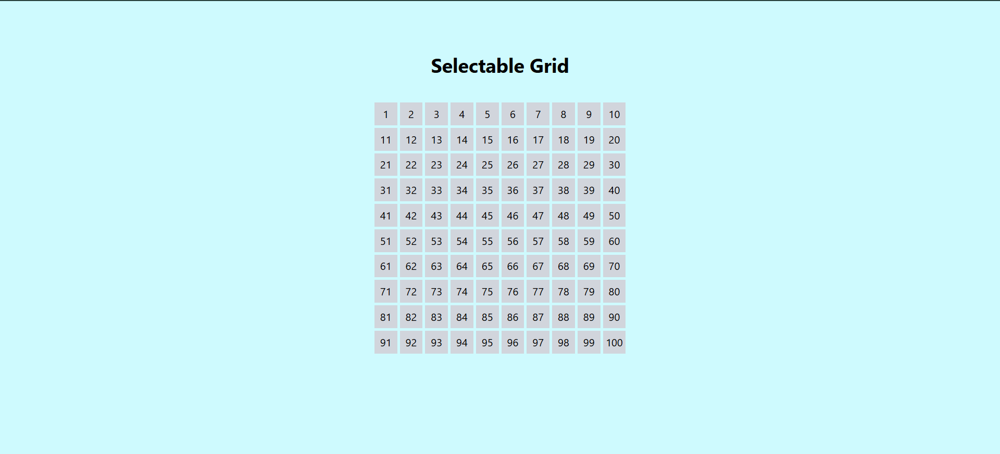
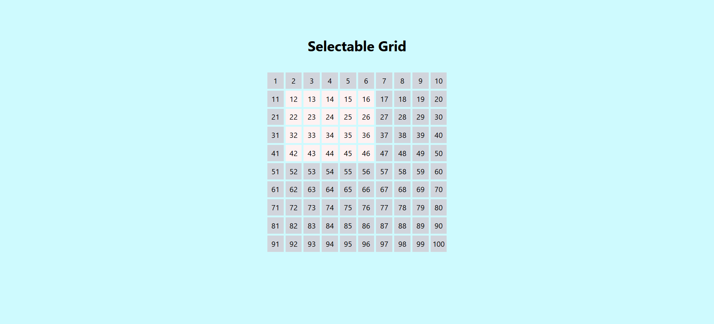

# Selectable Grid

A sample React + TypeScript project showcasing a grid where users can click and drag to select multiple cells.

## Features

- Click and drag to select multiple cells
- Customizable grid size
- Highlight selected cells
- Responsive design

## Installation

1. Clone the repository:

```sh
git clone https://github.com/Meet5555/Selectable-Grid-React.git
```

2. Navigate to the project directory:

```sh
cd Selectable-Grid-React
```

3. Install dependencies:

```sh
npm install
```

## Usage

1. Start the development server:

```sh
npm run dev
```

2. Open your browser and navigate to `http://localhost:5173`

## Screenshots

### Initial Grid



### Selected Cells



## Contributing

Contributions are welcome! Please open an issue or submit a pull request.

## License

This project is licensed under the MIT License.
